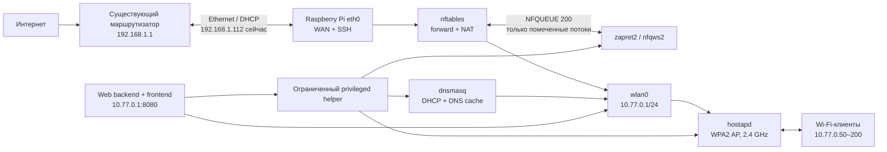
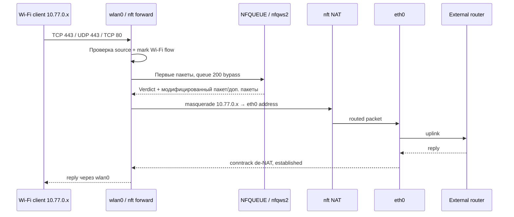

# Архитектура Wi‑Fi-шлюза с zapret2 на Raspberry Pi 3B

## 1. Назначение и границы документа

Система превращает Raspberry Pi 3 Model B в отдельный IPv4 Wi‑Fi-шлюз:

- `eth0` подключен к существующему маршрутизатору и остается каналом управления Raspberry Pi по SSH;
- `wlan0` работает как точка доступа для отдельной подсети;
- клиенты `wlan0` получают адрес, DNS и шлюз от Raspberry Pi;
- их интернет-трафик маршрутизируется и NAT-транслируется в `eth0`;
- выбранные начальные пакеты TCP/UDP Wi‑Fi-клиентов проходят через `nfqws2` из проекта zapret2;
- локальный трафик самой Raspberry Pi, включая SSH через `eth0`, не направляется в zapret2;
- локальный веб-интерфейс управляет настройками и показывает состояние системы.

Документ является проектным решением. На Raspberry Pi при обследовании ничего не устанавливалось, не запускалось и не перенастраивалось.

## 2. Исходное состояние устройства

Снимок получен по SSH 22 июня 2026 года командами только на чтение.

| Параметр | Обнаружено |
|---|---|
| Плата | Raspberry Pi 3 Model B Rev 1.2 |
| ОС | Debian GNU/Linux 13.5 (trixie), arm64 |
| Ядро | `6.18.34+rpt-rpi-v8` |
| CPU | 4 × ARM Cortex-A53, 600–1200 МГц |
| RAM | 905 MiB доступно ОС; на момент проверки около 736 MiB available |
| Swap | 905 MiB zram |
| Хранилище | 57 GiB ext4, около 53 GiB свободно |
| Ethernet | `eth0`, `192.168.1.112/24` по DHCP |
| Основной шлюз | `192.168.1.1` через `eth0`, metric 100 |
| Wi‑Fi | `wlan0`, Broadcom BCM43438, драйвер `brcmfmac`, сейчас выключен |
| Wi‑Fi PHY | 2,4 ГГц, HT20, режим AP поддерживается, 5/6 ГГц не поддерживаются |
| Регион | `RU`; доступны каналы 1–13, канал 14 запрещен |
| Менеджер сети | NetworkManager 1.52.1; управляет `eth0` |
| `hostapd` | не установлен |
| `dnsmasq` | установлен только `dnsmasq-base`; системный сервис отсутствует |
| `nftables` | 1.1.3 установлен, сервис disabled/inactive, ruleset пуст |
| IPv4 forwarding | не включен |
| IPv6 forwarding | не включен |

`nmcli` отдельно подтверждает для `wlan0`: AP mode — yes, WPA2/CCMP — yes, только диапазон 2,4 ГГц. Аппаратная часть подходит для небольшой домашней точки доступа, но не для высокой плотности клиентов или высокой скорости.

## 3. Принятые архитектурные решения

### 3.1. Разделение WAN и LAN

- WAN/uplink: `eth0`, существующая сеть `192.168.1.0/24`, адрес продолжает выдаваться внешним DHCP.
- Wi‑Fi LAN: `wlan0`, новая подсеть `10.77.0.0/24`.
- Адрес шлюза и веб-интерфейса: `10.77.0.1`.
- DHCP-пул: `10.77.0.50–10.77.0.200`.
- Начальный вариант — только маршрутизируемый IPv4. IPv6 forwarding блокируется, пока не будет отдельно спроектирован IPv6 prefix delegation/NAT66 и эквивалентная обработка zapret2.

Подсеть `10.77.0.0/24` выбрана как маловероятно конфликтующая с существующей `192.168.1.0/24`. Перед внедрением все равно нужна проверка на конфликт с VPN и другими локальными маршрутами.

### 3.2. Владение интерфейсами

Чтобы два сетевых менеджера не спорили за один интерфейс:

- NetworkManager продолжает единолично управлять `eth0` и профилем `Wired connection 1`;
- `wlan0` объявляется unmanaged для NetworkManager;
- `systemd-networkd` получает узкий `.network`-файл только для `wlan0` и назначает `10.77.0.1/24` без default route и без DNS;
- `hostapd` переводит тот же `wlan0` в AP mode.

Это сохраняет действующий Ethernet-профиль и минимизирует риск потерять SSH. Альтернатива — создать hotspot целиком средствами NetworkManager, но тогда NetworkManager сам поднимает DHCP/NAT и конкурирует с требуемыми `dnsmasq` и проектным ruleset. Для управляемой, проверяемой архитектуры это менее прозрачно.

### 3.3. Раздельное владение nftables

Используются независимые таблицы:

- `inet zapret_rpi` — базовый firewall, forwarding и NAT, владелец проекта;
- `inet zapret2` — NFQUEUE-цепочки и sets, владелец upstream zapret2.

Проект не выполняет глобальный `flush ruleset`. Каждая служба изменяет только собственную таблицу. Это предотвращает взаимное удаление NAT, правил SSH или zapret2.

### 3.4. Модель отказа

NFQUEUE-правила создаются с флагом `bypass`, как в upstream zapret2. Если `nfqws2` остановлен, интернет у Wi‑Fi-клиентов продолжает работать без DPI-обхода. Это fail-open модель: доступность важнее принудительной блокировки трафика.

## 4. Схема компонентов



## 5. Сетевое взаимодействие

### 5.1. Подключение клиента

1. `hostapd` публикует SSID на `wlan0` с WPA2-PSK/CCMP.
2. Клиент аутентифицируется и отправляет DHCP Discover.
3. `dnsmasq`, привязанный только к `wlan0`, выдает:
   - адрес из `10.77.0.50–10.77.0.200`;
   - mask `/24`;
   - router `10.77.0.1`;
   - DNS `10.77.0.1`;
   - ограниченный lease time, например 12 часов.
4. DNS-запросы клиента принимает локальный `dnsmasq` и пересылает на явно заданные upstream resolver'ы либо на DNS, полученный Raspberry по Ethernet. Рекомендуется явная пара resolver'ов, чтобы перезапуск NetworkManager не менял поведение Wi‑Fi DNS неожиданно.

`dnsmasq` должен использовать `bind-dynamic`, `interface=wlan0`, `listen-address=10.77.0.1` и не слушать `eth0`. Это исключает раздачу DHCP в существующую Ethernet-сеть.

### 5.2. Доступ к самой Raspberry Pi

Из Wi‑Fi LAN разрешаются только необходимые локальные сервисы:

- UDP 67 — DHCP;
- UDP/TCP 53 — DNS;
- TCP 80 на Ethernet и TCP 8080 на Wi‑Fi — web UI;
- ICMP echo с rate limit — диагностика;
- SSH с `wlan0` по умолчанию запрещен; управление SSH остается на `eth0`.

На `eth0` сохраняется доступ к TCP 22 из существующей LAN. Изменение DHCP-профиля, адреса, gateway или DNS `eth0` не входит в проект Wi‑Fi-шлюза.

## 6. Маршрутизация и firewall

### 6.1. Таблица маршрутизации

После внедрения ожидаются основные маршруты:

```text
default via 192.168.1.1 dev eth0 proto dhcp
192.168.1.0/24 dev eth0 scope link src <DHCP-адрес Pi>
10.77.0.0/24 dev wlan0 scope link src 10.77.0.1
```

Policy routing не требуется. Включается `net.ipv4.ip_forward=1`. IPv6 forwarding остается `0`.

### 6.2. Логическая политика nftables

Input:

- accept `ct state established,related`;
- accept loopback;
- accept SSH на `eth0` из доверенной Ethernet-подсети;
- accept DHCP, DNS и web UI на `wlan0`;
- drop invalid;
- остальное drop с ограниченным логированием.

Forward:

- accept `established,related` из `eth0` в `wlan0`;
- accept `new,established` из `wlan0` в `eth0`, только с source `10.77.0.0/24`;
- запретить forwarding `wlan0 → wlan0` на уровне firewall в дополнение к `ap_isolate`, если изоляция клиентов включена;
- запретить остальные направления.

NAT:

```text
ip saddr 10.77.0.0/24 oifname "eth0" masquerade
```

Masquerade нужен, поскольку адрес `eth0` динамический и внешний маршрутизатор не знает маршрут к `10.77.0.0/24`.

### 6.3. Путь пакета Wi‑Fi-клиента



Конкретное расположение zapret2 в post-NAT или pre-NAT зависит от `POSTNAT`. Для данного шлюза рекомендуется upstream default `POSTNAT=1`: zapret2 ставит nft hook после srcnat и корректно работает с forwarded/NAT traffic. Диагностика в таком режиме видит адрес `eth0`, а не исходный адрес клиента.

## 7. Интеграция zapret2

### 7.1. Изученная структура upstream

Анализ выполнен по официальному репозиторию `bol-van/zapret2`, commit `8afe88dea7c5f7374f302f947a9d938352c685a2`:

- `nfq2/` — исходники `nfqws2`, Linux backend использует NFQUEUE;
- `lua/` — библиотека и стратегии обработки пакетов (`zapret-lib.lua`, `zapret-antidpi.lua`, `zapret-auto.lua`);
- `common/` — shell-библиотека управления firewall, daemon и списками;
- `init.d/` — интеграции systemd/SysV/OpenWrt и custom hooks;
- `ipset/` — host/IP lists и загрузчики списков;
- `files/fake/` — готовые payload blobs;
- `blockcheck2.sh` и `blockcheck2.d/` — подбор/проверка стратегий;
- `config.default` — стандартная конфигурация;
- `docs/manual.md` — полное описание `nfqws2` и firewall integration;
- `binaries/` — бинарники не хранятся в Git, они берутся из release или собираются из исходников.

Для arm64 Debian предпочтительна воспроизводимая сборка из закрепленного commit либо проверяемый arm64 release с checksum. Runtime размещается в `/opt/zapret2`; изменяемые настройки — в `/etc/zapret2` или в проектном каталоге состояния с root-owned symlink/copy.

### 7.2. Базовая конфигурация

Проект должен формировать эквивалент следующих параметров upstream:

```sh
FWTYPE=nftables
POSTNAT=1
NFQWS2_ENABLE=1
NFQWS2_PORTS_TCP=80,443
NFQWS2_PORTS_UDP=443
NFQWS2_TCP_PKT_OUT=20
NFQWS2_TCP_PKT_IN=0
NFQWS2_UDP_PKT_OUT=5
NFQWS2_UDP_PKT_IN=0
MODE_FILTER=none
FLOWOFFLOAD=none
IFACE_LAN=wlan0
IFACE_WAN=eth0
DISABLE_IPV6=1
FILTER_MARK=0x10000000
FILTER_LAN_IP=10.77.0.0/24
FILTER_LAN_ALLOW_OUTPUT=0
```

Также устанавливается upstream custom hook `init.d/custom.d.examples.linux/99-lan-filter` в активный для classic Linux каталог `init.d/sysv/custom.d/`. Он ставит `FILTER_MARK` только forwarded-пакетам, пришедшим с `wlan0` и имеющим source из Wi‑Fi-подсети.

### 7.3. Почему одного `IFACE_LAN` недостаточно

В текущем upstream `IFACE_LAN` для classic Linux в стандартном пути в основном определяет LAN interfaces для flow offload. Это не является гарантией, что NFQUEUE увидит только Wi‑Fi-трафик. Жесткое разделение обеспечивает комбинация:

1. `FILTER_MARK` — стандартные outgoing zapret2 hooks принимают только помеченные пакеты;
2. `99-lan-filter` — mark назначается только `iifname wlan0` + `ip saddr 10.77.0.0/24`;
3. `FILTER_LAN_ALLOW_OUTPUT=0` — пакеты, созданные самой Raspberry Pi, не маркируются;
4. `*_PKT_IN=0` — стандартные входящие reverse hooks не создаются.

Последний пункт принципиален. В текущем upstream mark filter проверяется для outgoing/postrouting activation, но не ограничивает reverse/prerouting hook тем же client flow. Если оставить `PKT_IN > 0`, ответы на собственные соединения Raspberry Pi к TCP 80/443 или UDP 443 также могут попасть в NFQUEUE. Поэтому первая версия использует только outgoing desync-стратегии.

Если выбранная стратегия требует анализа входящих пакетов или `autohostlist`, нужна вторая версия интеграции: custom nft hook сохраняет признак Wi‑Fi-потока в `ct mark`, а reverse hook ставит пакет в очередь только при `ct mark & FILTER_MARK != 0`. До реализации и тестов такого connmark path включать `PKT_IN` нельзя.

### 7.4. Стратегии и списки

Начальная стратегия не должна считаться универсальной: ее подбирают `blockcheck2.sh` через реального провайдера на `eth0`, затем фиксируют в `NFQWS2_OPT`. Рекомендуемый порядок:

1. начать со стандартных профилей TCP 80, TCP 443/TLS и UDP 443/QUIC;
2. измерить CPU, packet loss и throughput на Pi 3B;
3. выбрать `MODE_FILTER=hostlist` или `autohostlist` только при реальной необходимости;
4. ограничивать число перехватываемых пакетов параметрами `*_PKT_OUT`;
5. не включать software/hardware flow offload до отдельных тестов совместимости.

`MODE_FILTER=none` проще для первой проверки, но применяет стратегии ко всем соответствующим портам Wi‑Fi-клиентов. Hostlists снижают побочные эффекты, однако требуют обновления списков и аккуратной DNS-логики. Обновление списков должно быть отдельным timer/service и не блокировать старт шлюза.

## 8. Компоненты и сервисы

| Компонент | Назначение | Предлагаемая служба |
|---|---|---|
| NetworkManager | Сохраняет действующий DHCP/uplink на `eth0` | `NetworkManager.service` |
| systemd-networkd | Назначает только `10.77.0.1/24` интерфейсу `wlan0` | `systemd-networkd.service` |
| hostapd | WPA2 Wi‑Fi AP на BCM43438 | `hostapd.service` |
| dnsmasq | DHCPv4 и DNS cache только для Wi‑Fi LAN | `dnsmasq.service` |
| nftables | Input/forward/NAT и изоляция подсетей | `nftables.service` |
| zapret2/nfqws2 | Обработка выбранных пакетов из NFQUEUE | `zapret2.service` либо hardened `nfqws2@wifi.service` |
| List updater | Обновление host/IP lists, если они включены | `zapret2-list-update.timer` |
| Web backend | API, status, валидация настроек | `zapret-rpi-web.service` |
| Web frontend | Статические assets, встроенные в backend | отдельная служба не нужна |
| Apply helper | Минимальный root helper для атомарного применения | oneshot `zapret-rpi-apply.service` |

### 8.1. Рекомендуемый порядок запуска

```text
NetworkManager (eth0)
  └─ network-online.target
systemd-networkd (wlan0 address)
  ├─ hostapd
  ├─ dnsmasq
  └─ nftables/base gateway rules
       └─ zapret2/nfqws2
            └─ web backend (может стартовать независимо, но показывает degraded state)
```

`zapret2` должен стартовать после `nftables.service` и после появления `eth0`/`wlan0`. Queue rules используют `bypass`, поэтому короткая гонка старта не обрывает connectivity. Web backend не должен быть условием работы маршрутизации.

## 9. Локальный веб-интерфейс

### 9.1. Backend

Реализация использует FastAPI/Uvicorn с одним worker и собранный React frontend. Backend работает от отдельного непривилегированного пользователя `zapret-web`, слушает только `10.77.0.1:8080` и не запускает произвольный shell.

Контракт реализованных маршрутов, страниц и компонентов приведён в `docs/ui.md`; совместимые маршруты управления профилями также сохранены в `docs/api.md`.

### 9.2. Привилегии и безопасность

Backend не работает от root и вызывает строго ограниченный helper через sudoers allowlist. Helper:

1. принимает JSON только для фиксированного action;
2. проверяет SSID, channel, длину и алфавит PSK, имя профиля и диапазон log tail;
3. создаёт staging-файл в project-owned каталоге;
4. атомарно заменяет только принадлежащие проекту файлы;
5. перезапускает только allowlisted units;
6. при провале health check возвращает предыдущую конфигурацию.

Web UI не имеет отдельной авторизации и доступен только из разрешённых локальных подсетей. Wi‑Fi PSK никогда не возвращается API целиком и не попадает в journal. На `eth0` используется отдельный HTTP unit на TCP 80; firewall ограничивает его непосредственно подключённой локальной подсетью.

## 10. Предполагаемая структура проекта

```text
zapret-rpi/
├── web/
│   ├── backend/zapret_ui/      # FastAPI handlers и helper client
│   └── frontend/               # React source и production dist
├── configs/
│   ├── hostapd/
│   ├── dnsmasq/
│   ├── nftables/
│   ├── networkd/
│   ├── NetworkManager/
│   ├── zapret2/
│   └── sysctl.d/
├── systemd/
│   ├── zapret-rpi-web.service
│   └── zapret-rpi-*.service   # project-owned units
├── scripts/
│   ├── install.sh
│   ├── validate.sh
│   └── smoke-test.sh
├── tests/
├── docs/
│   ├── architecture.md
│   └── ui.md
└── .env                       # только локальный SSH bootstrap, не deploy
```

На устройстве:

```text
/opt/zapret2/                  # pinned upstream runtime
/usr/local/sbin/zapret-rpi-*  # эксплуатационные команды и helper
/usr/local/lib/zapret-rpi/web # Python venv, backend и React assets
/etc/zapret-rpi/              # сгенерированная активная конфигурация
/var/lib/zapret-rpi/           # autotune state и backups
/var/log/                      # journald; отдельные бесконечные логи не нужны
```

`.env` должен быть исключен из Git и никогда не копироваться в web root или на Pi как конфигурация приложения.

## 11. План верификации перед внедрением

1. Зафиксировать backup текущих NetworkManager profile, routes, nft ruleset и enabled units.
2. Проверить `hostapd` на выбранном канале без изменения `eth0`.
3. Проверить DHCP только на `wlan0` packet capture'ом с обеих сторон.
4. Перед применением выполнить `nft -c -f`; затем подтвердить SSH по `eth0` из отдельной сессии.
5. Проверить маршрутизацию без zapret2: DNS, HTTP, HTTPS, QUIC.
6. Включить NFQUEUE с pass-through стратегией и проверить counters: очередь должна расти только для source Wi‑Fi LAN.
7. Сгенерировать трафик с самой Pi через `eth0`; counters NFQUEUE не должны измениться.
8. Остановить `nfqws2` и подтвердить fail-open поведение.
9. Прогнать `blockcheck2` и зафиксировать работающую стратегию.
10. Выполнить нагрузочный тест и проверить CPU, RAM, температуру, packet loss и throughput.
11. Проверить rollback web UI при неверных hostapd/dnsmasq/nft конфигурациях.

Критические приемочные инварианты:

- SSH на текущем Ethernet-адресе доступен до, во время и после применения;
- DHCP-пакеты проекта никогда не выходят через `eth0`;
- ни один packet с локальным origin Raspberry Pi не попадает в NFQUEUE 200;
- Wi‑Fi-клиент не может подменить source вне `10.77.0.0/24`;
- при остановке web UI шлюз продолжает работать;
- после reboot порядок сервисов воспроизводим.

## 12. Риски и ограничения

### Аппаратные

- Raspberry Pi 3B поддерживает только 2,4 ГГц 802.11n и один spatial stream; радиоэфир будет главным ограничителем раньше Ethernet.
- Ethernet у Pi 3B подключен через USB 2.0 и имеет номинальный предел 100 Мбит/с; реальная скорость ниже.
- `nfqws2` работает в userspace и добавляет CPU cost. Сложные Lua-стратегии, широкий UDP capture и большие hostlists могут заметно снизить throughput.
- 1 GiB RAM достаточно для небольшой точки, но чрезмерные nft sets/IP lists и отладочные логи опасны. В upstream default `SET_MAXELEM=522288`; для Pi следует ограничить реальные наборы и измерить память.
- Нужны качественный блок питания и охлаждение; throttling ухудшит стабильность под нагрузкой.

### Сетевые

- DHCP-адрес `eth0` может измениться; SSH лучше стабилизировать reservation на существующем маршрутизаторе, не переводя Pi на самовольный static address.
- Конфликт `10.77.0.0/24` с VPN нарушит маршрутизацию.
- IPv6 в первой версии намеренно не маршрутизируется. Иначе клиент может обойти IPv4 NAT/zapret policy или получить неработающий partial IPv6.
- DoH/DoT нельзя принудительно заменить обычным DNS без отдельной политики. Это не мешает маршрутизации, но ограничивает hostlist, зависящие от наблюдения DNS.
- `ap_isolate=1` запрещает прямое общение клиентов; это может ломать Chromecast, AirPlay, mDNS и локальные игры.
- Канал 2,4 ГГц следует выбирать по месту. Auto-channel у hostapd/драйвера не всегда предсказуем; начально предпочтительны 1, 6 или 11 после survey.

### zapret2

- Стратегия зависит от провайдера и меняется со временем; архитектура не гарантирует вечную работоспособность конкретного `NFQWS2_OPT`.
- Upstream развивается быстро, а interface/config compatibility может меняться. Нужен pinned commit/release и осознанное обновление.
- Incoming analysis и autohostlist требуют connmark-scoped custom rules; стандартный reverse hook нельзя включать при строгом требовании «не обрабатывать локальный Ethernet-трафик».
- Flow offload способен обходить часть netfilter path. Начальная конфигурация задает `FLOWOFFLOAD=none`.
- QUIC может потребовать более агрессивную обработку или временную блокировку UDP/443, что ухудшает latency и заставляет клиентов перейти на TCP/TLS.

### Эксплуатационные и security

- Ошибка firewall может отрезать SSH. Нужны syntax check, backup, автоматический rollback и отдельная контрольная SSH-сессия.
- Web UI является новой attack surface. Нельзя запускать backend от root, принимать shell fragments или публиковать UI на WAN/uplink без TLS и дополнительной аутентификации.
- Пароль Wi‑Fi и admin credentials являются секретами; backup и логи должны иметь режим `0600` и не содержать plaintext credentials без необходимости.
- `dnsmasq` и `hostapd` должны быть жестко привязаны к `wlan0`, иначе возможны rogue DHCP и публикация DNS resolver в Ethernet LAN.
- Обновление zapret2, списков и Debian packages должно быть атомарным, с rollback и проверкой checksum/signature там, где доступно.

## 13. Источники

- [bol-van/zapret2 — исследованный commit](https://github.com/bol-van/zapret2/tree/8afe88dea7c5f7374f302f947a9d938352c685a2)
- [zapret2 config.default](https://github.com/bol-van/zapret2/blob/8afe88dea7c5f7374f302f947a9d938352c685a2/config.default)
- [zapret2 manual](https://github.com/bol-van/zapret2/blob/8afe88dea7c5f7374f302f947a9d938352c685a2/docs/manual.md)
- [zapret2 nftables integration](https://github.com/bol-van/zapret2/blob/8afe88dea7c5f7374f302f947a9d938352c685a2/common/nft.sh)
- [zapret2 LAN filter example](https://github.com/bol-van/zapret2/blob/8afe88dea7c5f7374f302f947a9d938352c685a2/init.d/custom.d.examples.linux/99-lan-filter)
- [Raspberry Pi 3 Model B — официальный обзор](https://www.raspberrypi.com/products/raspberry-pi-3-model-b/)

Аппаратные и сетевые значения в разделе 2 получены непосредственно с целевого устройства и имеют приоритет над общими спецификациями продукта.
