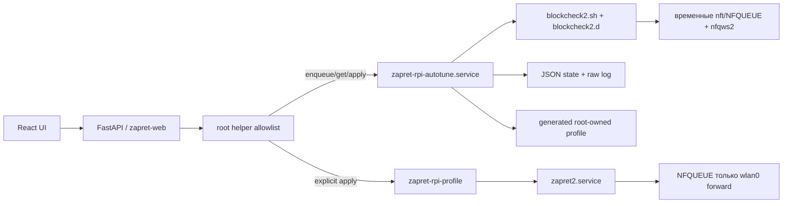

# Итоговая система zapret-rpi

## Назначение

Система превращает Raspberry Pi 3B в изолированный IPv4 Wi‑Fi-шлюз и автоматически подбирает стратегии zapret2 через реальное подключение провайдера. `eth0` остаётся WAN и каналом SSH, `wlan0` обслуживает `10.77.0.0/24`, а zapret2 получает только исходящие пакеты маршрутизируемых Wi‑Fi-клиентов. Локальный трафик Pi и входящие reverse hooks в NFQUEUE не включаются.

Автоподбор основан на штатном `/opt/zapret2/blockcheck2.sh` закреплённого commit `8afe88dea7c5f7374f302f947a9d938352c685a2`. Upstream-инструмент поддерживает пакетный режим, тестовые наборы `blockcheck2.d`, HTTP, TLS 1.2/1.3 и QUIC, повторы, уровни `quick`/`standard`/`force` и печатает успешные команды `nfqws2` в `SUMMARY`. Профили runtime остаются root-owned allowlist-файлами; произвольные аргументы из HTTP API не принимаются.

## Архитектура



HTTP-запрос только ставит задачу и сразу получает `202`. Долгая работа выполняется systemd oneshot-службой и не занимает Uvicorn worker. Во время blockcheck штатный `zapret2.service` останавливается, поскольку upstream требует тест без другого bypass/VPN software; NFQUEUE настроен fail-open. В `finally` runner восстанавливает прежнее состояние zapret2. При ручном запуске профиль применяет администратор; запуск от включённого монитора доступности применяет лучший результат автоматически.

Состояние записывается через временный файл и `os.replace`, поэтому API не видит частичный JSON. Выполняется только один запуск. Перезапуск web UI не прерывает тест; systemd и root-owned state не зависят от frontend.

## Структура каталогов

Исходный проект:

```text
configs/                         шаблоны сети, firewall и профилей
docs/                            архитектура, API, deployment, UI, итоговый документ
scripts/
  autotune.py                    очередь, runner, parser, scoring, profile generation
  web-helper.py                  фиксированные привилегированные действия
  profile.sh                     атомарное применение и rollback профиля
systemd/
  zapret-rpi-autotune.service    длительный oneshot
  zapret-rpi-autocheck.service   короткая проверка принятой доступности
  zapret-rpi-autocheck.timer     планировщик проверки
  zapret-rpi-web.service         непривилегированный API
tests/
  test_autotune.py               parser, safety и генерация профиля
web/backend/zapret_ui/           FastAPI и helper client
web/frontend/                    React source и production dist
```

На Raspberry Pi:

```text
/opt/zapret2/                                  pinned upstream и blockcheck2.d
/etc/zapret-rpi/zapret2/
  active.conf                                  symlink активного профиля
  profiles/*.conf                              статические профили и один autotune.conf
/usr/local/sbin/zapret-rpi-autotune            root-only runner
/usr/local/sbin/zapret-rpi-web-helper          allowlisted helper
/usr/local/sbin/zapret-rpi-profile             profile apply/rollback
/usr/local/lib/zapret-rpi/web/                 venv, backend, frontend bundle
/var/lib/zapret-rpi/autotune/
  current.json                                 текущий/последний запуск
  monitor.json                                 настройки, baseline и состояние проверки
  jobs/<id>.json                               результаты запусков
  jobs/<id>.log                                полный stdout blockcheck2
/var/lib/zapret-rpi/backup/original/           исходные файлы deployment
```

State и логи имеют режим `0600`, каталоги — `0700`. Web-пользователь не читает их напрямую: чтение выполняет фиксированный helper.

## Сервисы

| Сервис | Ответственность |
|---|---|
| `NetworkManager.service` | DHCP/default route и SSH-доступ через `eth0` |
| `systemd-networkd.service` | адрес `10.77.0.1/24` только на `wlan0` |
| `zapret-rpi-hostapd.service` | WPA2 AP |
| `zapret-rpi-dnsmasq.service` | DHCP/DNS только для Wi‑Fi LAN |
| `zapret-rpi-nftables.service` | firewall, forward и NAT в `inet zapret_rpi` |
| `zapret-rpi-web-lan.service` | HTTP-доступ к web UI на TCP 80 из Ethernet LAN |
| `zapret2.service` | штатный init wrapper, `nfqws2`, таблица `inet zapret2` |
| `zapret-rpi-web.service` | FastAPI и статический React bundle |
| `zapret-rpi-autotune.service` | один длительный запуск blockcheck2; не включается на boot |
| `zapret-rpi-autocheck.timer` | пробуждение проверки каждые 5 минут; выбранный интервал хранится в state |
| `zapret-rpi-autocheck.service` | HTTPS-probe доменов и постановка автоматического автоподбора |

## API

Маршруты доступны без авторизации только из локальных подсетей, разрешённых firewall.

| Метод | Маршрут | Результат |
|---|---|---|
| `POST` | `/api/v1/autotune/runs` | `202`, запуск в состоянии `queued` |
| `GET` | `/api/v1/autotune/runs/current` | текущий/последний запуск либо `null` |
| `GET` | `/api/v1/autotune/runs/{id}` | прогресс, request, score, стратегии и ошибки |
| `POST` | `/api/v1/autotune/runs/{id}/cancel` | остановка запуска и восстановление zapret2 |
| `POST` | `/api/v1/autotune/runs/{id}/apply` | применённый profile и runtime state |
| `GET` | `/api/v1/autotune/monitor` | настройки, baseline summary и состояние мониторинга |
| `PUT` | `/api/v1/autotune/monitor` | включение и параметры мониторинга |

Пример запуска:

```json
{
  "domains": ["rutracker.org", "example.org/path"],
  "protocols": ["http", "https", "quic"],
  "repeats": 2,
  "scan_level": "quick",
  "test_set": "standard"
}
```

Ограничения: 1–30 валидных доменов/URI-path, 1–5 повторов, IPv4, известный test set. `409` возвращается при конкурентной изменяющей операции, `422` — при ошибке модели, `503` — при отказе helper/runner. Остальные маршруты Wi‑Fi и zapret2 перечислены в `docs/ui.md` и `docs/api.md`.

## Веб-интерфейс

Раздел «Автоподбор» позволяет указать домены, повторы и глубину теста. UI показывает текущий домен, протокол, точную стратегию, число проверок, прошедшее время и рейтинг кандидатов. Процент кандидата — доля успешных попыток, coverage — доля доменов с хотя бы одним успехом. Быстрый режим использует `zapret-rpi-quick` с максимумом 20 отобранных стратегий на домен; standard/force запускают полный upstream-набор. Автоматика отмечает лучший вариант каждого протокола, после чего отметки можно изменить вручную. Осиротевший статус автоматически переводится в `failed`; длительность ограничена 20, 45 или 90 минутами.

В этом же разделе настраивается фоновая автопроверка с интервалом 15 минут–24 часа. Baseline допускает частичную доступность: поводом к переподбору считается только подтверждённая потеря ранее доступного домена. При неактивном профиле `Autotune`, выключенном zapret2 или уже работающем подборе проверка откладывается. Успешный автоматический профиль становится новой baseline; после срабатывания действует шестичасовой cooldown.

Доступ со стороны `wlan0` сохраняется через `http://10.77.0.1:8080`. Для локальной Ethernet LAN доступен отдельный HTTP-вход `http://<адрес-raspberry-pi>` на стандартном TCP-порту 80.

## Алгоритм автоподбора

1. Helper валидирует запрос, проверяет отсутствие `queued/running`, создаёт ID и атомарно сохраняет job.
2. Helper запускает `zapret-rpi-autotune.service --no-block`.
3. Runner запоминает активность `zapret2.service`, останавливает его и запускает blockcheck2 с `BATCH=1`, `IPVS=4`, выбранными `ENABLE_*`, `REPEATS`, `SCANLEVEL`, `TEST` и `DOMAINS`.
4. Каждая строка сохраняется в raw log. Для каждого кандидата runner учитывает попытки, успехи и домены, обновляет `current_test` и компактный рейтинг `candidates`. В быстром режиме progress считается от известного максимума; для полного upstream-перебора UI показывает число проверок и временной лимит без выдуманного процента.
5. Из `SUMMARY` извлекаются только строки `curl_test_http`, `curl_test_https_tls12/13`, `curl_test_http3` с командой `nfqws2`.
6. Аргументы разбираются `shlex`; временные `--qnum`, `--wf-*`, daemon/uid/gid/pidfile удаляются. Каждый оставшийся token обязан начинаться с `--` и соответствовать безопасному алфавиту. Shell substitutions, quotes, separators и свободные пути отклоняются.
7. Кандидаты группируются по protocol + strategy. Основной критерий — доля доменов, на которых вариант успешен; при равенстве предпочтительна меньшая сложность (число аргументов, fake и repeats). Score = coverage × 100 минус небольшая complexity penalty.
8. Лучшие независимые стратегии HTTP, TLS и QUIC объединяются в единый `autotune.conf` при нажатии «Применить отмеченные стратегии». Базовая конфигурация продолжает принудительно задавать IPv4-only, `PKT_IN=0`, `FLOWOFFLOAD=none` и Wi‑Fi mark.
9. `bash -n` проверяет базовую конфигурацию и профиль. Runner сохраняет результат и восстанавливает исходное состояние zapret2.
10. По подтверждению `zapret-rpi-profile set` атомарно меняет symlink, перезапускает службу, проверяет active state и откатывает ссылку при ошибке.

Добавление тестов не требует изменения orchestrator: новый каталог `/opt/zapret2/blockcheck2.d/<name>` становится доступным через `test_set`. Для управляемого deployment его следует хранить в репозитории и устанавливать root-owned; формат custom-набора соответствует upstream `blockcheck2.d/custom` и спискам `list_http.txt`, `list_https_tls12.txt`, `list_https_tls13.txt`, `list_quic.txt`.

## Обновление

1. Создать резервную копию по следующему разделу и дождаться окончания активного автоподбора:

   ```bash
   systemctl is-active zapret-rpi-autotune.service
   ```

2. Обновить рабочую копию проекта и проверить изменение pinned commit, `blockcheck2` и формата summary. При смене upstream обязательно обновить `REVISION`, parser fixtures и документацию.
3. На рабочей станции выполнить:

   ```powershell
   cd web/frontend
   npm ci
   npm run build
   cd ../..
   ./scripts/deploy.ps1 -HostName pi.local -User root
   ```

4. Installer сохраняет существующий валидный active profile, обновляет managed files и выполняет validation.
5. После обновления:

   ```bash
   sudo zapret-rpi-validate
   sudo zapret-rpi-smoke-test
   systemctl status zapret-rpi-web zapret2
   ```

6. Выполнить короткий автоподбор на одном домене и одном повторе, проверить progress/result, но применять результат только после просмотра coverage.

## Резервное копирование

Не копировать state во время записи. Сначала дождаться завершения теста; затем создать архив на файловой системе с достаточным свободным местом:

```bash
sudo install -d -m 700 /var/backups/zapret-rpi
sudo tar --xattrs --acls -czf /var/backups/zapret-rpi/zapret-rpi-$(date +%Y%m%d-%H%M%S).tar.gz \
  /etc/zapret-rpi \
  /var/lib/zapret-rpi \
  /etc/systemd/system/zapret-rpi-*.service \
  /usr/local/sbin/zapret-rpi-autotune \
  /usr/local/sbin/zapret-rpi-profile \
  /usr/local/sbin/zapret-rpi-web-helper
sudo chmod 600 /var/backups/zapret-rpi/*.tar.gz
```

Архив содержит Wi‑Fi PSK, поэтому его нужно хранить зашифрованным и не помещать в web root/Git. Отдельно записать upstream commit (`git -C /opt/zapret2 rev-parse HEAD`) и checksum архива (`sha256sum`). `/opt/zapret2` можно не архивировать: он воспроизводится installer по pinned commit; для автономного восстановления его допустимо включить в архив.

## Восстановление

На работающей системе той же версии:

```bash
sudo systemctl stop zapret-rpi-autocheck.timer zapret-rpi-autocheck zapret-rpi-autotune zapret-rpi-web zapret2
sudo tar --xattrs --acls -xzf /path/to/zapret-rpi-backup.tar.gz -C /
sudo chown -R root:root /etc/zapret-rpi/zapret2 /var/lib/zapret-rpi/autotune
sudo chmod 700 /var/lib/zapret-rpi/autotune /var/lib/zapret-rpi/autotune/jobs
sudo chmod 600 /etc/zapret-rpi/zapret2/profiles/*.conf /var/lib/zapret-rpi/autotune/*.json /var/lib/zapret-rpi/autotune/jobs/* 2>/dev/null || true
sudo systemctl daemon-reload
sudo systemctl restart zapret-rpi-nftables zapret-rpi-hostapd zapret-rpi-dnsmasq zapret2 zapret-rpi-web
sudo zapret-rpi-validate
```

Если ОС переустановлена, сначала выполнить обычный deployment той же revision, остановить перечисленные службы, восстановить архив и повторить validation. Проверить, что `active.conf` указывает внутрь `/etc/zapret-rpi/zapret2/profiles`, затем протестировать SSH через `eth0`, DHCP/DNS/Интернет с Wi‑Fi-клиента и активный профиль. Незавершённый job из backup не возобновляется автоматически; его следует считать failed и запустить новый тест.

Для полного возврата к состоянию до проекта используется сохранённый deployment manifest:

```bash
sudo zapret-rpi-rollback
```

Rollback останавливает autotune, удаляет его state, `autotune.conf` и старые `auto-*.conf`, восстанавливает исходные managed files и состояния служб, не удаляя Debian packages и исходное дерево `/opt/zapret2`.
## Обновления web UI

- Панель открывается сразу, без логина, session cookie и CSRF.
- Раздел «Автоподбор» показывает live-индикатор, phase, текущую стратегию, количество проверенных вариантов и время последнего обновления.
- Проверяемые домены, число повторов и глубина автоподбора сохраняются в `localStorage` текущего браузера.
